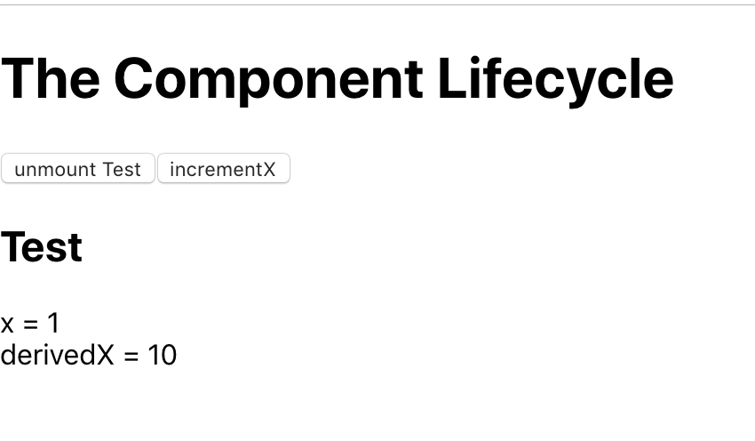

## Instructions for students:

### Create a React App using Lifecycle methods

Create a React App with one button to increment X by 1, it needs to increment at the same time derivedX by 10 (see image for reference). With another button the user should be able to unmount the component.

-   Check if the components are being updated, mounted, unmounted.

-   Here is an image for reference:
    

**Bonus**

-   Feel free to add more components
-   Feel free to add other Lifecycle methods

### Rules

-   This is an individual assignment.
-   Deadline: 1 Hour.
-   Use **Git properly**
-   Feel free to document your code with comments.
