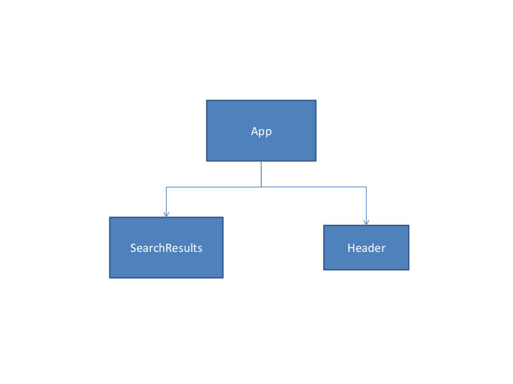
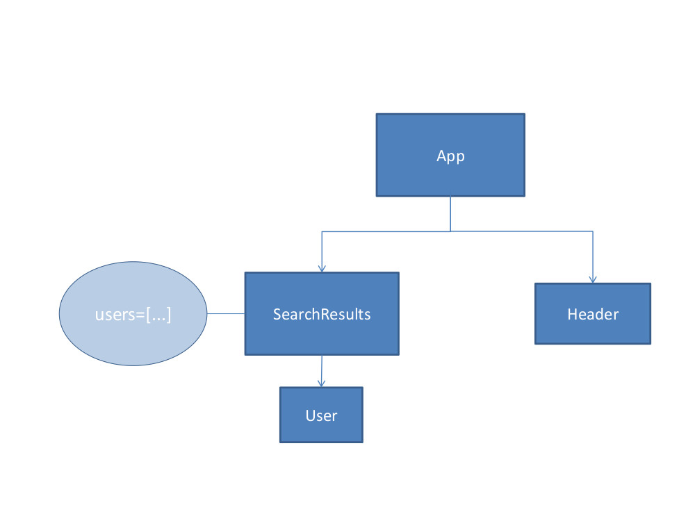
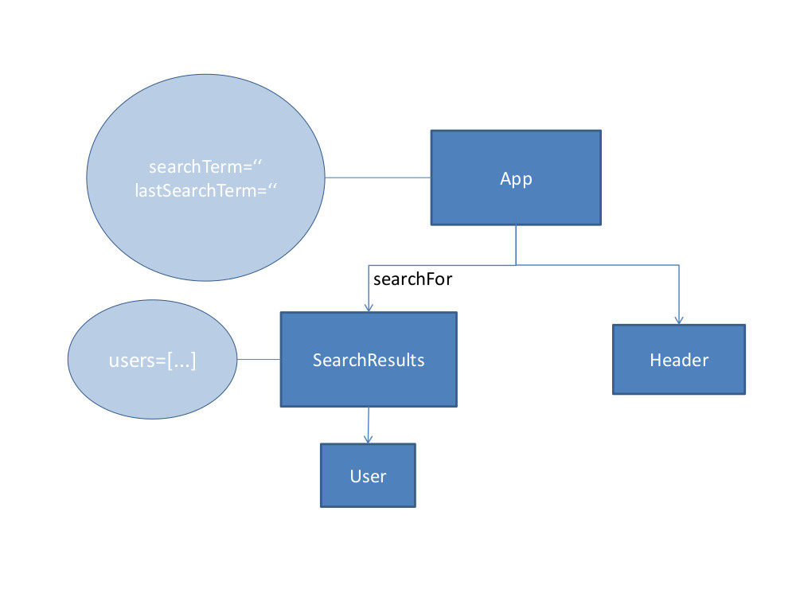
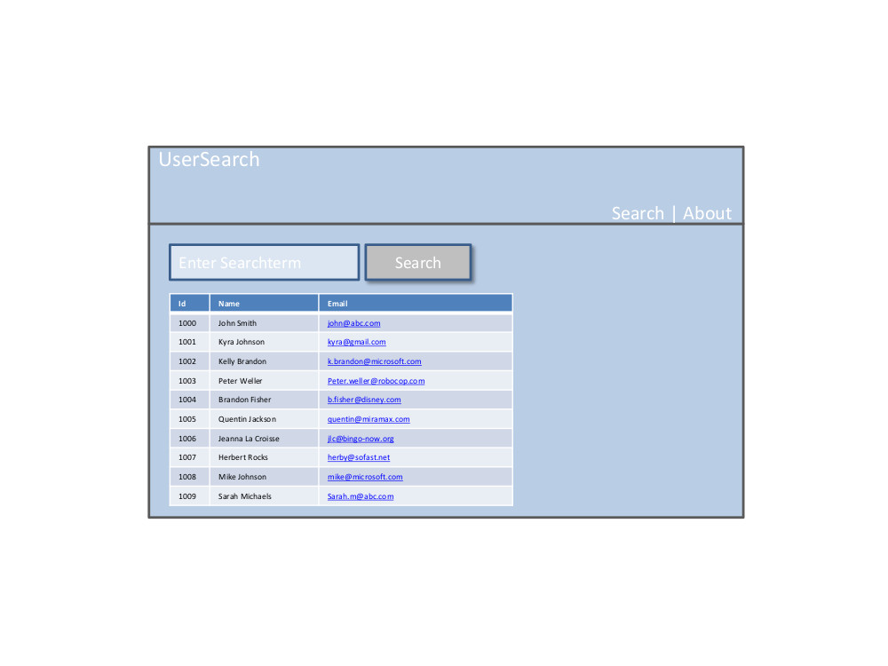
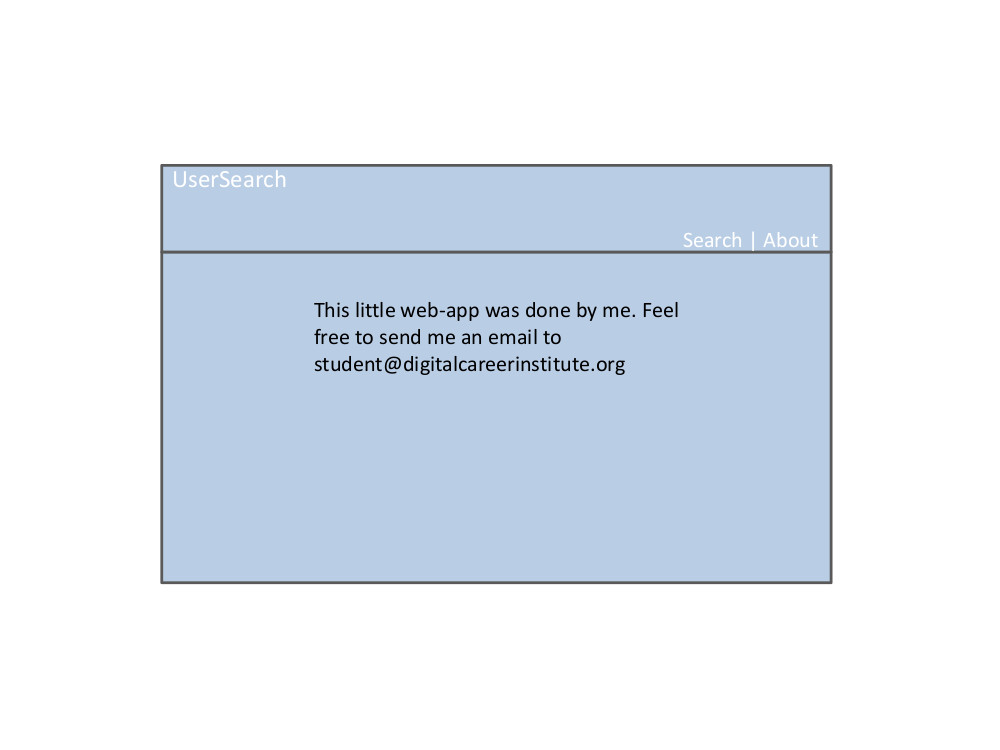

# Task 1: Layout

1. Create the following layout in the App-component. Do not create any other components yet

# Task 2: Component Structure

1. Create the stateless Header-component, to which you source out the header part of your layout.
2. Create the stateful SearchResults-component, to which you source out the table.

# Task 3: Adding State & User component

1. In the SearchResults-component‘s state,Use fetch to get data from API ([jsonplaceholder API link](https://jsonplaceholder.typicode.com/users)) and add receieved data into an array “users“ which should contain all of the user data shown in the table.
2. Create a stateless component “User“ which receives three props: id, name and email. User should return JSX of one table-row (tr) that consists of three table-cells (td). For id, name and email.
3. Inside SearchResult‘s table, render User-components instead of table-rows (tr). Therefore, use the state‘s users-Array and the Array.map method.

# Task 4: Adding Search Function

1. In the App-component‘s state, add a variable searchTerm. Add an onChange event for the searchbox and update  searchTerm whenever the textbox changes.
2. Add an onClick-event for the “Search“-button. When the button is clicked, lastSearchTerm will be set to searchTerm.
3. Pass lastSearchTerm as props down to the SearchResults-component. Name it “searchFor“.
4. Inside the SearchResults-component, filter the users-Array to the users where the name or email includes the incoming lastSearchTerm as substring. I.e. If the lastSearchTerm is „joh“ then only the users John Smith,Kyra Johnson and Mike Johnson will be shown.

### Adding State & User component

# Task 5: Only search again, if the searchterm differs

The goal of this task is to minimize the number of searches. Therefore, you only re-
render the SearchResults component if the new searchFor-prop is different from the
last one.

1. Do some research (Google) on the component-lifecycle method
    shouldComponentUpdate(nextProps) and try to become confident with it.
    **As a summary:** if you put it into your component, you decide when to re-render
    or not re-render. React will call your implementation of
    shouldComponentUpdate(nextProps).
2. Put the declaration of shouldComponentUpdate(nextProps) into your
    SearchResults-component. Take a closer look at the parameter nextProps (i.e.
    Use the debugger or console.log it out).
3. In your SearchResults-component, create a new class-member variable
    lastSearchTerm which is initially set to an empty string ‘‘. Whenever a new
    searchTerm is passed to SearchResults, update lastSearchTerm and re-render.
    Whenever it is equal to the old one, do not re-render. Eventually, render your
    table-output based on your class-member variable lastSearchTerm.

# Task 6: Adding a navigation without React-Router

1. In your Header-component, add the following two span-elements containing “Search“ and “About“.

2. Create a new stateless component “About“ which only shows one horizontally centered div displaying.

3. Inside the App-component‘s state, create the variable “currentPage“ that is initially set to “search“.
4. Implement the following conditional-rendering: whenever currentPage is set to “search“, the SearchResults- component will be shown. Whenever it is set to “about“, the About-component will be shown. Test it by setting currentPage to “about“ and reload the page: now only the About-component is shown.

### A: When your App-component‘s state variable “currentPage“ is set to **“about“** , this should be the output:

### B: When your App-component‘s state variable “currentPage“ is set to **“search“,** this should be the output:

5. In the App-component, create a method navigate(page) that changes the currentPage
    to page.
6. Pass the App‘s navigate-method down to the Header-component as prop
    “navigationHandler“.
7. Inside the Header, add onClick-events that call the navigationHandler-reference with
    either “search“ or “about“.
8. Test it. When you can click “Search“ and you see the SearchResults-component or you
    click “About“ and you see the About-component, it worked.
9. Inside SearchResults, implement the method componentDidMount(). Inside, print out
    to the console “The SearchResult-component has mounted.“
10. Again inside SearchResults, implement the method componentWillUnmount. Inside,
    print out to the console “The SearchResults-component will unmount“.
11. Test your web-app now. When you click on “Search“ and then on “About“, what do you
    see in the console? How can you explain this output?

# Task 7 (Advanced): FETCH 
### When the SearchResults-component mounts,load the user-data from

[jsonplaceholder API link](https://jsonplaceholder.typicode.com/users)

